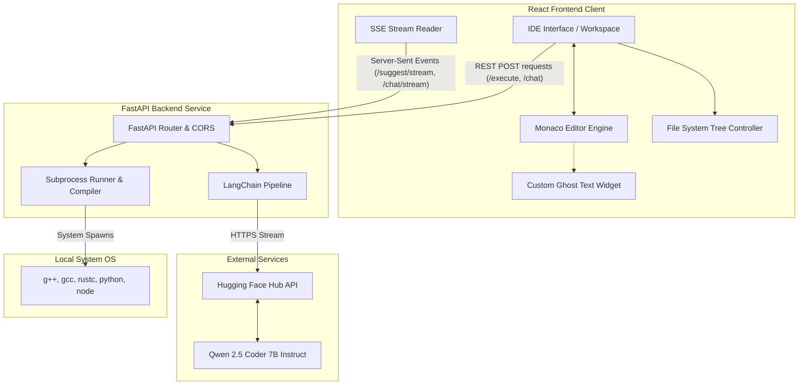
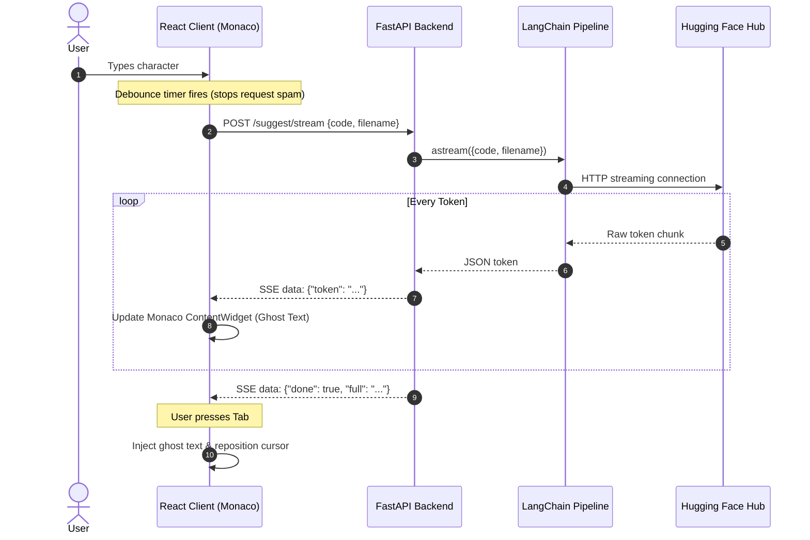
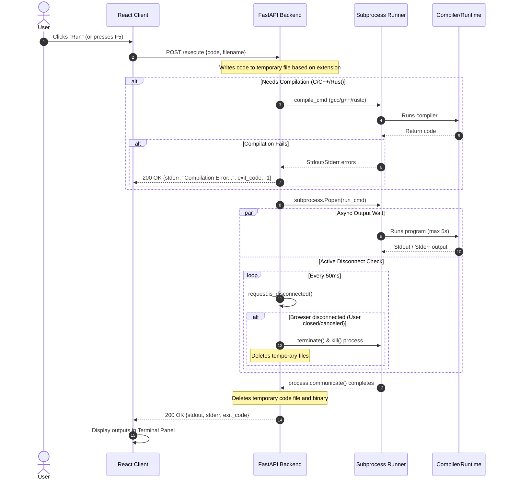

# CodeLab AI IDE: Architecture Overview & Presentation Guide

This document provides a comprehensive breakdown of the technical architecture of **CodeLab**, a premium browser-based AI Integrated Development Environment (IDE). It is designed to serve as a reference and a presentation-ready guide for your college project review.

---

## 1. High-Level Architecture Overview

CodeLab is built using a decoupled client-server architecture consisting of a **React-based Single Page Application (SPA)** on the frontend and an **asynchronous FastAPI service** on the backend. It integrates LLMs using **LangChain** and runs arbitrary user code locally using an execution runner.

---

## 2. Frontend Architecture (React Client)

The frontend is a React application managing a workspace designed to look and feel like a modern, premium desktop IDE.

### Key Libraries & Core Tech Stack
*   **React 19**: Manages UI state, workspaces, panels, and live state synchronization.
*   **Monaco Editor (`@monaco-editor/react`)**: The exact core engine powering VS Code. It handles syntax highlighting, code indentation, line folding, search/replace, and default autocomplete menus.

### Architectural Subcomponents
1.  **File System Tree Representation (`fileTree.js`)**:
    *   Since it is a web app, file structures are modeled in React state as flat keys (e.g., `"src/app.py"`).
    *   A utility builds a nested object structure dynamically (`buildFileTree()`) which allows the sidebar tree node components to expand, collapse, rename, add, and delete files.
2.  **Custom Inline Autocomplete Widget (Ghost Text)**:
    *   To simulate GitHub Copilot, the app overlays suggestions directly inside Monaco.
    *   Instead of standard CSS positioning hacks, it registers a custom **Monaco ContentWidget**. This is a React/JS widget injected directly into Monaco's layout engine, allowing multi-line greyed-out "ghost text" to sit inline at the exact line and column of the user's cursor.
    *   **Prefix-Suffix Overlap Correction**: If a user is typing *while* suggestions stream, the editor compares the current cursor prefix with the suggestion. It dynamically slices off already-typed characters (`getOverlapLength()`) so the user can hit **Tab** to merge suggestions without duplicate text.
3.  **Flexible Draggable Panels**:
    *   Custom mouse-drag event listeners dynamically compute panel widths and heights (sidebar width, terminal height, assistant sidebar width) on mouse move, providing a fluid desktop-like environment.

---

## 3. Backend Architecture (FastAPI Service)

The backend is built in Python using **FastAPI** to support asynchronous operations, high concurrency, and low latency streaming.

### Key Libraries & Core Tech Stack
*   **FastAPI**: Serves endpoints, manages server-sent event streams, and handles asynchronous request cancellation.
*   **LangChain HuggingFace (`langchain_huggingface`)**: Interfaces with LLMs. It handles prompt structuring (`PromptTemplate`), output formatting, and model execution chaining (`LCEL`).
*   **Hugging Face Hub API**: Connects to remote endpoint instances hosting open-source LLM models.

### Dual-LLM Pipeline Design
To deliver optimal results, CodeLab utilizes a single model (`Qwen/Qwen2.5-Coder-7B-Instruct`) configured as two separate pipelines tailored for their specific use-cases:

| Feature | Pipeline | Max Output Tokens | Temp | Rationale |
| :--- | :--- | :--- | :--- | :--- |
| **Inline Autocomplete** | `llm` (Copilot-style) | `256` | `0.2` | Lower temperature ensures high deterministic accuracy. Lower token limit makes predictions brief (2-8 lines max) and instantaneous. |
| **AI Chat & Actions** | `chat_llm` (Assistant) | `1024` | `0.4` | Higher token ceiling gives room for detailed step-by-step explanations, code refactoring blocks, and markdown formatting. |

---

## 4. Sequence Diagrams (Key Data Flows)

### Flow A: Real-Time Inline Suggestion (SSE Streaming)
This shows how CodeLab delivers fast autocomplete without blocking the UI.

### Flow B: Secure Code Execution
This outlines how CodeLab runs code dynamically while handling timeouts and cancellations.

---

## 5. Technical Highlights & Features to Present

When explaining this project to evaluators, emphasize these advanced implementation patterns:

1.  **Server-Sent Events (SSE) vs WebSockets**:
    *   *Point to explain*: "We chose SSE (`text/event-stream`) over WebSockets because our communication is primarily one-way streaming (model tokens coming to the client). SSE is lighter, operates over standard HTTP, and has automatic reconnection support."
2.  **Asynchronous Process Lifecycle Management**:
    *   *Point to explain*: "Running untrusted code presents security and resource issues. Our `/execute` runner solves this by keeping track of the active process globally, utilizing strict execution timeouts (5 seconds), and checking for client disconnects (`request.is_disconnected()`). If a user runs an infinite loop and closes the window, the server immediately cleans up the processes and files."
3.  **Monaco ContentWidget Overlays**:
    *   *Point to explain*: "Rather than modifying the code model directly while the AI is generating suggestions (which would mess up undo/redo stacks and copy-paste buffers), we use Monaco's `ContentWidget` APIs to overlay a visual-only 'ghost preview'. This mimics commercial IDEs like VS Code."
4.  **Decoupled Language Support**:
    *   *Point to explain*: "The runner maps extensions (`.py`, `.js`, `.c`, `.cpp`, `.rs`) to system runtimes (`python`, `node`, `gcc`, `g++`, `rustc`). This makes the application easily extensible to any programming language by configuring compilation and execution commands."

o explain this clearly in your presentation, it helps to break the code execution process down into 5 distinct phases.

Here is exactly how the backend executes user code (under the hood in 

main.py
):

Phase 1: File Generation & Extension Routing
When a user clicks "Run" in the React editor:

The frontend sends an HTTP POST request to /execute containing:
The raw code (as a string).
The filename (e.g., script.py, main.cpp, or app.js).
The backend extracts the file extension (e.g., py, cpp, c, rs, js).
It creates a temporary file on the server's disk using Python’s tempfile module (e.g., C:\Users\...\AppData\Local\Temp\tmp_xyz.py). Writing the code to a physical file is necessary because compilers (like gcc) and runtimes (like node) need a file path to read from.
Phase 2: Compilation (Compiled Languages Only)
Before running code, certain languages must be compiled into machine instructions.

Interpretation (Python / JS): The compilation step is skipped.
Compilation (C / C++ / Rust):
The backend spawns a compilation subprocess using tools like g++ (for C++), gcc (for C), or rustc (for Rust). For example:
bash
g++ -O2 <temp_file_path> -o <temp_exe_name>
Error Handling: The backend runs the compiler with an 8-second timeout. If compilation fails (returns a non-zero exit code), it immediately stops the process and returns the compiler's stderr output (syntax errors) to the client so it can be displayed in the terminal panel.
Phase 3: Spawning the Subprocess
Once the interpreter command is built or the executable binary is compiled:

The backend launches the code inside a new isolated OS process using Python’s subprocess.Popen:
For Python: [python, temp_file.py]
For Node.js: [node, temp_file.js]
For Compiled C/C++/Rust: [temp_file.exe]
Platform Compatibility (Windows vs. Unix): On Windows, it sets the creationflags to CREATE_NEW_PROCESS_GROUP. This isolates the program in its own command group, making it possible to send signals (like Ctrl+C) to just this running program without affecting the main server.
Phase 4: Non-Blocking Execution & Disconnect Polling (Crucial Slide Point)
Normally, running a subprocess blocks the server until the program completes. If a user writes an infinite loop (e.g., while True: pass), the server would freeze. CodeLab solves this with two mechanisms:

Async Thread Execution: It delegates the blocking process.communicate() call to an async thread pool (asyncio.to_thread). This allows the main server thread to stay free and handle other users.
Client Disconnection Polling: While the program runs in the background, a while loop checks if the program is finished:
Every 50 milliseconds, it calls await request.is_disconnected().
If the user closes their browser tab or hits the "Stop" button, the client disconnects.
The backend immediately detects this, stops waiting, and forcefully terminates (process.terminate()) and kills (process.kill()) the subprocess.
Execution Timeout: If the program takes longer than 5 seconds to run, the backend kills it automatically and throws a timeout error.
Phase 5: Output Collection & Cleanup
Once the process completes, the backend reads the standard output (stdout) and standard error (stderr) pipes.
It returns a JSON object back to the React client:
json
{
  "stdout": "Hello World!\n",
  "stderr": "",
  "exit_code": 0
}
The finally Block: To prevent the server's hard drive from filling up, the backend runs a cleanup step inside a finally block. This guarantees that the temporary code file (e.g., .py or .cpp) and the compiled binary executable (.exe) are deleted immediately, regardless of whether the execution succeeded, crashed, or was terminated.
Slide Presentation Tip 💡
If asked, "Why didn't you just use Python's exec() function?"

Answer: "Using exec() only supports Python and executes the code inside the parent web-server process itself, which is extremely dangerous. If a user writes os.system('shutdown'), it would shut down our server. By spawning a decoupled subprocess.Popen in the OS, we isolate the execution from the web server and can easily support multiple compilers (C, C++, Rust, Node.js)."

11:06 PM, 6/3/2026
